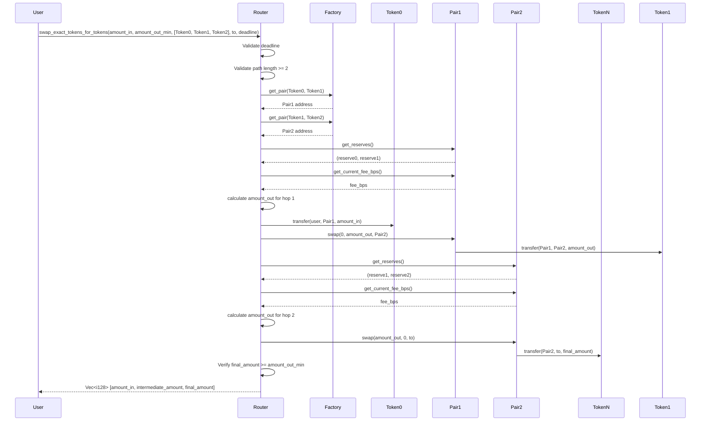

# Design Document

## Overview

The Router contract's `swap_exact_tokens_for_tokens` function implements multi-hop token swapping by orchestrating a sequence of atomic swaps across multiple Pair contracts. The design follows the Uniswap V2 router pattern adapted for Soroban, where the router acts as a stateless coordinator that:

1. Validates input parameters and deadline
2. Retrieves Pair contract addresses from the Factory
3. Calculates expected output amounts using constant-product math
4. Transfers input tokens from the user to the first Pair
5. Executes sequential swaps, routing intermediate outputs to subsequent Pairs
6. Ensures the final output meets slippage protection requirements
7. Delivers output tokens to the specified recipient

The implementation prioritizes correctness, gas efficiency, and composability with existing Pair and Factory contracts.

## Architecture

### Component Interaction Flow



### Key Design Decisions

1. **Stateless Router**: The Router maintains no state, relying entirely on Factory and Pair contracts
2. **Pre-transfer Pattern**: Following Uniswap V2, input tokens are transferred to Pairs before calling swap
3. **Sequential Execution**: Hops execute in order, with each output becoming the next input
4. **Factory Integration**: All Pair addresses are retrieved from Factory to ensure consistency
5. **Dynamic Fee Support**: Each hop queries the Pair's current fee, supporting time-varying fees

## Components and Interfaces

### Router Contract

**Primary Function:**
```rust
pub fn swap_exact_tokens_for_tokens(
    env: Env,
    amount_in: i128,
    amount_out_min: i128,
    path: Vec<Address>,
    to: Address,
    deadline: u64,
) -> Result<Vec<i128>, RouterError>
```

**Helper Functions (in helpers.rs):**

```rust
pub fn get_amount_out(
    env: &Env,
    amount_in: i128,
    reserve_in: i128,
    reserve_out: i128,
    fee_bps: u32,
) -> Result<i128, RouterError>
```

Calculates output amount using the constant-product formula:
```
amount_out = (amount_in * (10000 - fee_bps) * reserve_out) / (reserve_in * 10000 + amount_in * (10000 - fee_bps))
```

```rust
pub fn sort_tokens(
    token_a: &Address,
    token_b: &Address,
) -> Result<(Address, Address), RouterError>
```

Returns tokens in canonical order (lexicographically sorted) to match Factory's pair creation logic.

### External Contract Interfaces

**Factory Contract:**
```rust
pub fn get_pair(env: Env, token_a: Address, token_b: Address) -> Option<Address>
```

**Pair Contract:**
```rust
pub fn swap(env: Env, amount_a_out: i128, amount_b_out: i128, to: Address) -> Result<(), PairError>
pub fn get_reserves(env: Env) -> (i128, i128, u64)
pub fn get_current_fee_bps(env: Env) -> u32
```

**Token Contract (Soroban Token Interface):**
```rust
pub fn transfer(env: Env, from: Address, to: Address, amount: i128)
pub fn transfer_from(env: Env, spender: Address, from: Address, to: Address, amount: i128)
```

## Data Models

### Path Structure

The `path` parameter is a `Vec<Address>` where:
- `path[0]` = input token address
- `path[path.len()-1]` = output token address
- Each consecutive pair `(path[i], path[i+1])` represents a hop through a Pair contract

**Example:** For a 3-hop swap A→B→C→D:
```
path = [AddressA, AddressB, AddressC, AddressD]
hops = [
  (AddressA, AddressB),  // hop 0
  (AddressB, AddressC),  // hop 1
  (AddressC, AddressD),  // hop 2
]
```

### Amounts Vector

The return value `Vec<i128>` contains the amount at each step:
- `amounts[0]` = amount_in (input)
- `amounts[i]` = output of hop i-1 (input to hop i)
- `amounts[path.len()-1]` = final output amount

### Token Ordering

Pair contracts store tokens in canonical order where `token_a < token_b` (lexicographic comparison). When calling `Pair::swap(amount_a_out, amount_b_out, to)`:
- If swapping token_a → token_b: `amount_a_out = 0`, `amount_b_out = calculated_output`
- If swapping token_b → token_a: `amount_a_out = calculated_output`, `amount_b_out = 0`


## Correctness Properties

*A property is a characteristic or behavior that should hold true across all valid executions of a system—essentially, a formal statement about what the system should do. Properties serve as the bridge between human-readable specifications and machine-verifiable correctness guarantees.*

After analyzing the acceptance criteria, several properties are logically redundant and can be consolidated:

**Redundancy Analysis:**
- Properties 2.2 and 2.3 both test slippage protection and can be combined into a single property
- Properties 3.2 and 3.3 both test deadline validation and can be combined
- Properties 4.2 and 4.3 both test routing destinations and can be combined
- Properties 6.1, 6.2, 6.3, and 6.4 all test the amount calculation logic and can be combined
- Properties 7.1 and 7.2 both test token ordering and can be combined
- Properties 8.1, 8.3, and 8.4 all test Factory integration and can be combined

### Property 1: Sequential hop execution
*For any* valid path with N tokens, executing swap_exact_tokens_for_tokens should result in exactly N-1 swap calls to Pair contracts, one for each consecutive token pair in the path.
**Validates: Requirements 1.1, 1.2**

### Property 2: Amount chaining consistency
*For any* multi-hop swap, the output amount from hop i should equal the input amount for hop i+1, and the returned amounts vector should have length equal to the path length.
**Validates: Requirements 1.3, 1.4**

### Property 3: Slippage protection enforcement
*For any* swap execution, if the final output amount is less than amount_out_min, the function should revert with InsufficientOutputAmount error; otherwise, it should complete successfully.
**Validates: Requirements 2.1, 2.2, 2.3**

### Property 4: Positive intermediate outputs
*For any* successful multi-hop swap, each intermediate hop should produce a positive output amount sufficient to serve as input for the next hop.
**Validates: Requirements 2.4**

### Property 5: Deadline validation
*For any* call to swap_exact_tokens_for_tokens, if the current ledger timestamp exceeds the deadline parameter, the function should revert with Expired error; otherwise, it should proceed with execution.
**Validates: Requirements 3.1, 3.2, 3.3**

### Property 6: Initial token transfer
*For any* valid swap, the Router should transfer exactly amount_in of path[0] tokens from the caller to the first Pair contract before executing any swaps.
**Validates: Requirements 4.1**

### Property 7: Correct routing destinations
*For any* multi-hop swap with N hops, intermediate hops (0 to N-2) should route output to the next Pair contract, and the final hop (N-1) should route output to the 'to' address.
**Validates: Requirements 4.2, 4.3**

### Property 8: Final recipient balance increase
*For any* successful swap, the balance of the 'to' address for the output token should increase by at least amount_out_min.
**Validates: Requirements 4.4**

### Property 9: Invalid path rejection
*For any* path with length less than 2, or where path[i] equals path[i+1] for any i, the function should revert with InvalidPath or IdenticalTokens error respectively.
**Validates: Requirements 5.1, 5.5**

### Property 10: Non-existent pair handling
*For any* path containing a token pair for which Factory::get_pair returns None, the function should revert with PairNotFound error.
**Validates: Requirements 5.4, 8.2**

### Property 11: Constant-product calculation correctness
*For any* hop with reserves (reserve_in, reserve_out) and fee fee_bps, the calculated output amount should satisfy the constant-product formula: amount_out = (amount_in * (10000 - fee_bps) * reserve_out) / (reserve_in * 10000 + amount_in * (10000 - fee_bps)).
**Validates: Requirements 6.1, 6.2, 6.3, 6.4**

### Property 12: Canonical token ordering
*For any* pair of tokens (token_x, token_y), when calling Pair::swap, the Router should respect the canonical ordering where token_a < token_b, setting amount_a_out or amount_b_out to zero based on swap direction.
**Validates: Requirements 7.1, 7.2**

### Property 13: Factory integration consistency
*For any* path with N tokens, the Router should make exactly N-1 calls to Factory::get_pair and use the returned addresses for all subsequent Pair interactions.
**Validates: Requirements 8.1, 8.3, 8.4**

## Error Handling

### Error Types and Conditions

| Error | Condition | Recovery |
|-------|-----------|----------|
| `Expired` | `env.ledger().timestamp() > deadline` | User must submit new transaction with updated deadline |
| `InvalidPath` | `path.len() < 2` | User must provide valid path with at least 2 tokens |
| `IdenticalTokens` | `path[i] == path[i+1]` | User must remove duplicate adjacent tokens from path |
| `ZeroAmount` | `amount_in <= 0` | User must provide positive input amount |
| `InsufficientOutputAmount` | `final_amount < amount_out_min` | User must increase slippage tolerance or retry with better market conditions |
| `PairNotFound` | `Factory::get_pair returns None` | Liquidity pair doesn't exist; user must choose different path |
| `Overflow` | Arithmetic overflow in calculations | Indicates amounts too large; user must reduce trade size |

### Error Handling Strategy

1. **Early Validation**: Check deadline, path validity, and amount validity before any state changes
2. **Fail-Fast**: Revert immediately on first error to minimize gas costs
3. **Atomic Execution**: All swaps succeed or entire transaction reverts (no partial execution)
4. **Clear Error Messages**: Each error type maps to specific user-facing condition

## Testing Strategy

### Unit Testing Approach

Unit tests will cover specific scenarios and edge cases:

1. **Happy Path Tests**:
   - 2-hop swap (A→B→C)
   - 3-hop swap (A→B→C→D)
   - Single-hop swap (A→B)

2. **Edge Case Tests**:
   - Path length = 2 (minimum valid)
   - Path length = 10 (stress test)
   - amount_in = 1 (minimum positive)
   - amount_out_min = 0 (no slippage protection)
   - deadline = current_timestamp (boundary)

3. **Error Condition Tests**:
   - Expired deadline
   - Invalid path (length < 2)
   - Identical adjacent tokens
   - Zero or negative amount_in
   - Non-existent pair
   - Insufficient output (slippage exceeded)

### Property-Based Testing Approach

Property-based tests will verify universal properties across randomly generated inputs using the **proptest** crate for Rust. Each test will run a minimum of 100 iterations.

**Test Configuration:**
```rust
use proptest::prelude::*;

proptest! {
    #![proptest_config(ProptestConfig::with_cases(100))]
    // test implementation
}
```

**Property Test Structure:**

1. **Generators**: Create random but valid test inputs
   - Random paths of length 2-5
   - Random amounts within reasonable bounds
   - Random token addresses
   - Random deadlines (past and future)

2. **Invariant Checks**: Verify properties hold for all generated inputs
   - Amount chaining (output[i] = input[i+1])
   - Slippage protection (final >= min)
   - Balance changes (recipient receives correct amount)
   - Error conditions (invalid inputs cause correct errors)

3. **Property Test Tagging**: Each property-based test must include a comment linking to the design document:
   ```rust
   // **Feature: router-multi-hop-swap, Property 2: Amount chaining consistency**
   #[test]
   fn prop_amount_chaining() { ... }
   ```

**Key Properties to Test:**

- **Property 1**: Sequential hop execution (verify N-1 swaps for N tokens)
- **Property 2**: Amount chaining (output[i] = input[i+1])
- **Property 3**: Slippage protection (final >= min or revert)
- **Property 5**: Deadline validation (expired → revert)
- **Property 8**: Balance increase (recipient balance grows correctly)
- **Property 11**: Math correctness (constant-product formula)

### Integration Testing

Integration tests will verify interaction with real Pair and Factory contracts:

1. Deploy Factory, Pair, and Router contracts
2. Create liquidity pools with known reserves
3. Execute multi-hop swaps and verify end-to-end behavior
4. Test with dynamic fees (varying fee_bps values)
5. Verify event emissions from Pair contracts

### Test Coverage Goals

- **Line Coverage**: > 90% of router implementation
- **Branch Coverage**: 100% of error conditions
- **Property Coverage**: All 13 correctness properties tested
- **Edge Case Coverage**: All boundary conditions tested

## Implementation Notes

### Algorithm Pseudocode

```
function swap_exact_tokens_for_tokens(amount_in, amount_out_min, path, to, deadline):
    // 1. Validate deadline
    if env.ledger().timestamp() > deadline:
        return Err(Expired)
    
    // 2. Validate path
    if path.len() < 2:
        return Err(InvalidPath)
    
    // 3. Validate amount
    if amount_in <= 0:
        return Err(ZeroAmount)
    
    // 4. Initialize amounts vector
    amounts = Vec::new()
    amounts.push(amount_in)
    
    // 5. Calculate output amounts for each hop
    for i in 0..(path.len() - 1):
        token_in = path[i]
        token_out = path[i + 1]
        
        // Get pair address from factory
        pair = Factory::get_pair(token_in, token_out)
        if pair.is_none():
            return Err(PairNotFound)
        
        // Get reserves and fee
        (reserve_in, reserve_out) = get_sorted_reserves(pair, token_in, token_out)
        fee_bps = pair.get_current_fee_bps()
        
        // Calculate output
        amount_out = get_amount_out(amounts[i], reserve_in, reserve_out, fee_bps)
        amounts.push(amount_out)
    
    // 6. Verify minimum output
    final_amount = amounts[amounts.len() - 1]
    if final_amount < amount_out_min:
        return Err(InsufficientOutputAmount)
    
    // 7. Transfer input tokens to first pair
    first_pair = Factory::get_pair(path[0], path[1]).unwrap()
    TokenClient::new(path[0]).transfer_from(caller, first_pair, amount_in)
    
    // 8. Execute swaps
    for i in 0..(path.len() - 1):
        token_in = path[i]
        token_out = path[i + 1]
        pair = Factory::get_pair(token_in, token_out).unwrap()
        
        // Determine destination for this hop
        if i < path.len() - 2:
            // Intermediate hop: send to next pair
            next_pair = Factory::get_pair(path[i + 1], path[i + 2]).unwrap()
            destination = next_pair
        else:
            // Final hop: send to recipient
            destination = to
        
        // Determine swap parameters based on token ordering
        (token_a, token_b) = sort_tokens(token_in, token_out)
        if token_in == token_a:
            // Swapping A → B
            pair.swap(0, amounts[i + 1], destination)
        else:
            // Swapping B → A
            pair.swap(amounts[i + 1], 0, destination)
    
    return Ok(amounts)
```

### Performance Considerations

1. **Gas Optimization**:
   - Minimize storage reads by caching Factory address
   - Batch validation checks before any external calls
   - Use efficient arithmetic (avoid unnecessary conversions)

2. **Call Depth**:
   - Each hop adds 2-3 external calls (get_reserves, get_fee, swap)
   - Maximum practical path length: ~5 hops (limited by gas)

3. **Precision**:
   - All calculations use i128 to prevent overflow
   - Fee calculations use basis points (10000 = 100%) for precision

### Security Considerations

1. **Reentrancy**: Router is stateless, so reentrancy is not a concern
2. **Front-running**: Users should set appropriate amount_out_min to protect against sandwich attacks
3. **Integer Overflow**: All arithmetic operations must use checked math
4. **Authorization**: Caller must have approved Router to spend input tokens
5. **Deadline Protection**: Prevents execution of stale transactions at unfavorable prices
