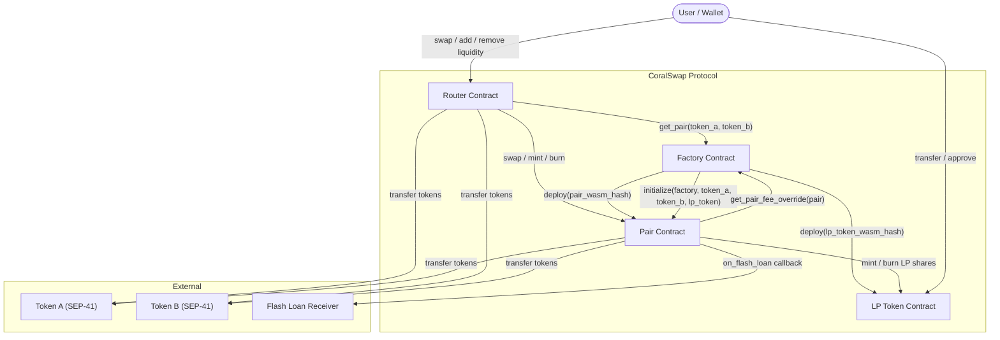

# CoralSwap Architecture

This document describes the high-level architecture of the CoralSwap V1 protocol on Soroban (Stellar).

## Contract Overview

CoralSwap is an automated market maker (AMM) built on Soroban smart contracts. The protocol consists of four core contracts and two supporting contracts that work together to provide decentralized token swaps and liquidity provision.

| Contract | Purpose |
|---|---|
| **Factory** | Deploys and registers Pair/LP Token contracts; manages protocol-wide settings and upgrades |
| **Pair** | Holds reserves for a token pair; executes swaps, mints/burns LP shares, and provides flash loans |
| **LP Token** | SEP-41 compliant token representing a liquidity provider's share of a Pair pool |
| **Router** | User-facing entry point for swaps and liquidity operations; handles multi-hop routing |
| **Flash Receiver Interface** | Trait that flash-loan receivers must implement (`on_flash_loan` callback) |
| **Mock Flash Receiver** | Test-only contract used to exercise flash-loan and malicious-receiver paths |

## Contract Interaction Diagram



## Contract Roles

### Factory

The Factory is the registry and governance hub of the protocol.

- **Pair creation**: Deploys a new Pair contract and its associated LP Token contract using deterministic salts derived from the token addresses. Stores the pair mapping in both directions (`(A,B)` and `(B,A)`).
- **Governance**: Manages a multisig signer set (1–10 signers, threshold = `ceil(n/2)`). Multisig is required for pause/unpause and upgrade operations.
- **Protocol fees**: The `fee_to_setter` address can set a protocol-wide fee recipient (`fee_to`) and fee rate (`fee_bps`, max 30 bps). Per-pair fee overrides (max 100 bps) are also supported.
- **Upgrades**: A timelocked upgrade mechanism (72-hour delay, ~51,840 ledgers) allows the Factory WASM to be replaced via `propose_upgrade` → `execute_upgrade`. Upgrades can be cancelled before execution.
- **Pause**: The protocol can be paused/unpaused by multisig, which blocks new pair creation.

### Pair

Each Pair contract holds reserves of two tokens and implements the constant-product AMM (`x * y = k`).

- **Swap**: Validates the K invariant after fee deduction. Fees are dynamic — computed from a volatility-tracking EMA with configurable baseline, min, max, ramp-up, and cooldown parameters. A per-pair fee override from the Factory takes precedence when set.
- **Mint**: Accepts token deposits and mints LP shares proportional to the deposit. On first mint, `MINIMUM_LIQUIDITY` shares are locked to the contract itself.
- **Burn**: Burns LP tokens and returns pro-rata reserves. Supports standard two-sided burn and single-sided burn (with an internal swap leg).
- **Flash Loans**: Lends reserve tokens to a receiver contract, requires repayment (principal + fee) in the same transaction.
- **Oracle**: Tracks cumulative prices for TWAP queries (`consult_twap`).
- **Reentrancy Guard**: All state-mutating swap and burn paths are protected by a storage-based reentrancy lock.

### LP Token

A SEP-41 compliant fungible token contract.

- Minted and burned exclusively by the authorized Pair contract (admin).
- Supports `transfer`, `transfer_from`, `approve`, and `permit` (off-chain signature approval).
- Admin can `pause`/`unpause` all token operations and transfer the admin role.

### Router

The user-facing contract that simplifies interaction with the protocol.

- **Swap routing**: Finds the best path across 1-hop (direct), 2-hop, and 3-hop routes using configurable hub tokens. Supports both `swap_exact_tokens_for_tokens` and `swap_tokens_for_exact_tokens`.
- **Liquidity**: `add_liquidity` computes optimal deposit amounts to preserve pool ratios; `remove_liquidity` burns LP tokens and enforces minimum output amounts.
- **Deadline enforcement**: All user-facing operations accept a deadline timestamp and revert if expired.

## Soroban Reentrancy Model

> **Read this before touching any state-mutating path in the Pair contract.**
> Contributors familiar with Solidity often carry over reentrancy assumptions that
> do not map cleanly onto Soroban. The differences are architectural, not cosmetic.

### Why This Is Different From Solidity

In Solidity, reentrancy is a runtime control-flow problem: an external contract
called from inside a function can re-enter that same function *before the first
call has finished*, because the EVM processes everything inside a single shared
mutable world state per transaction. The classic attack path is:

```
Victim.withdraw()
  → Attacker.receive()        ← ETH transfer triggers fallback
    → Victim.withdraw()       ← re-enters before balance update
      → (funds drained)
```

Solidity mitigations (Checks-Effects-Interactions, `ReentrancyGuard` modifier)
exist precisely to enforce that state is committed *before* external calls.

### Soroban's Single-Frame Execution Model

Soroban contracts run inside the Soroban host, which imposes a **single-frame,
copy-on-write execution model**:

- **One logical execution frame per top-level invocation.** Each contract
  function call runs inside the host's WASM executor. The host is the sole
  authority over which storage writes are committed and in what order.
- **Ledger state is a snapshot.** Each invocation starts with a snapshot of
  ledger state. Writes accumulate in a *working set* (not yet committed to the
  ledger) for the duration of the frame.
- **Host abort rolls back the working set atomically.** If any sub-call panics
  or returns an unhandled error, the host unwinds the entire call stack and
  discards *all* writes in that frame — including writes made by the outer
  caller before the sub-call. There is no partial commit.
- **No implicit callbacks.** Unlike Solidity's ETH transfers triggering
  fallback functions, Soroban token transfers are explicit cross-contract
  calls with no implicit re-entry point.

The practical implication: Soroban does **not** suffer from the classic
Solidity withdraw-then-drain reentrancy pattern. A contract that writes state
before calling an external contract will see those writes rolled back if the
outer frame aborts.

### The Residual Attack Surface

Despite the snapshot model, a storage-based reentrancy guard is still necessary
in CoralSwap for the following reasons:

#### 1. Cross-Contract Calls During the Flash Loan Callback

The Pair contract calls `receiver.on_flash_loan(...)` while it is in a
partially-mutated state (tokens have been transferred out, reserves not yet
updated). If the lock is **not** held:

- The `MaliciousFlashReceiver` could call `Pair::swap()` during the callback.
  At that moment the pair's *in-memory working set* reflects the pre-loan
  reserve snapshot. A reentrant swap would compute prices against stale
  reserves, potentially draining the pool at an artificially favorable rate.
- A nested `Pair::flash_loan()` call would bypass the repayment check for the
  outer loan, because the outer loan's repayment verification has not yet run.

#### 2. State Consistency Across Sub-Frame Boundaries

Soroban's copy-on-write model operates at the *ledger entry* level. Within a
single top-level invocation, sub-calls to the same contract share the *same
working set* for that contract's instance storage. A reentrant call therefore
observes whatever the outer call has written so far — including intermediate,
not-yet-validated state.

#### 3. The Guard Is a Correctness Invariant, Not Just a Safety Measure

Even if Soroban's host abort would eventually roll back a successful attack
(because the k-invariant check catches the violated reserves), relying on the
k-check alone is fragile: future code paths, upgraded contracts, or new pool
types might introduce windows where intermediate state is exploitable before
the invariant check. The reentrancy lock closes this window unconditionally.

### How the Guard Works in CoralSwap

The guard is implemented as a storage-based RAII lock in
[`contracts/pair/src/reentrancy.rs`](contracts/pair/src/reentrancy.rs) and
backed by instance storage in
[`contracts/pair/src/storage.rs`](contracts/pair/src/storage.rs) (`DataKey::Guard`).

```
initialize()  →  set Guard { locked: false }  (instance storage)

flash_loan() / swap() / burn()
  │
  ├─ ReentrancyGuard::acquire(&env)?
  │     reads  Guard.locked from instance storage
  │     if locked → Err(PairError::Locked)         ← reentrant call rejected
  │     else      → writes Guard { locked: true }
  │                 returns guard struct (RAII)
  │
  ├─ ... external calls (token transfers, on_flash_loan callback) ...
  │
  └─ guard dropped (happy path or early Err(...))
        Drop impl → writes Guard { locked: false }
```

**Key properties:**

| Property | Detail |
|---|---|
| **Acquired before any token movement** | Lock is set before the first `TokenClient::transfer` call in `flash_loan` |
| **RAII release** | `Drop` runs unconditionally on every exit path — no `unlock()` to forget |
| **Persisted in instance storage** | Visible to all re-entrant sub-calls on the same contract instance |
| **Error on re-entry** | Returns `PairError::Locked` (error code 106); host abort not required |
| **Tested adversarially** | `MaliciousFlashReceiver` exercises `attack_swap` and `attack_flash` paths |

### Host Abort and Error Propagation

When a Soroban contract panics (e.g., via `env.panic_with_error()`), the host
terminates that WASM frame and propagates the error up the call stack. The
calling contract receives this as an invocation failure.

In CoralSwap's flash loan path:

```rust
FlashReceiverClient::new(env, receiver)
    .try_on_flash_loan(...)
    .map_err(|_| PairError::FlashCallbackFailed)?   // invocation error
    .map_err(|_| PairError::FlashCallbackFailed)?;  // receiver contract error
```

`try_on_flash_loan` is used rather than `on_flash_loan` so that a panicking or
error-returning callback is caught and mapped to `PairError::FlashCallbackFailed`
rather than propagating the raw host panic up to the Router or end user. The
`?` then short-circuits before the repayment verification — a failed callback
cannot be mistaken for a successful repayment.

**Abort semantics in context:**

- If the outer `flash_loan` call itself returns `Err(...)`, the host discards
  all writes made during that invocation (reserves, guard state, token
  balances at the contract-instance level). The ledger is unchanged.
- If the host aborts the outer frame, the reentrancy guard storage entry is
  also rolled back — so the lock cannot get permanently stuck in the `locked`
  state due to an unexpected panic.
- The lock *can* appear stuck within the same invocation frame between the
  `acquire` call and the callback. This is by design: that window is exactly
  what the guard protects.

### Guard Coverage by Function

| Function | Protected | Notes |
|---|---|---|
| `flash_loan` | ✅ Yes | Acquired before transfer; all attack vectors tested |
| `swap` | ✅ Yes | Acquired at function entry |
| `burn` | ✅ Yes | Acquired at function entry |
| `mint` | ❌ No | Mint has no external callback; guard not needed |
| `initialize` | ❌ No | Admin-only, no external callback |

### For Contributors

When adding new state-mutating functions to the Pair contract:

1. **Identify external calls.** Any `TokenClient`, `LpTokenClient`, or
   cross-contract call within the function is a potential re-entry point.
2. **Acquire the guard before the first external call.** Use
   `ReentrancyGuard::acquire(&env)?` as the first mutable action.
3. **Do not call `release_lock` manually.** The RAII `Drop` handles this;
   manual release creates a window where the lock is dropped prematurely.
4. **Do not hold the guard across `await` or yield points** (not applicable
   today, but relevant if async Soroban execution is introduced).
5. **Add adversarial test cases.** Follow the pattern in
   `contracts/malicious_flash_receiver/` to exercise reentrant paths.

> See also: [SECURITY.md](SECURITY.md) — Reentrancy & Cross-Contract Calls

---

## V2 Architecture (Planned)

The V2 architecture is expected to introduce:

- Concentrated liquidity positions
- Enhanced oracle capabilities
- Additional pool types beyond constant-product

The current contract structure is designed to support forward evolution through the Factory's timelocked upgrade mechanism and per-pair fee flexibility.
